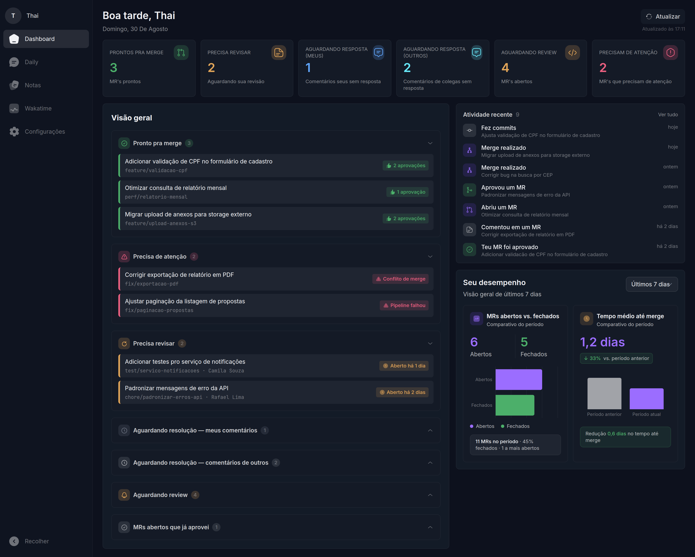
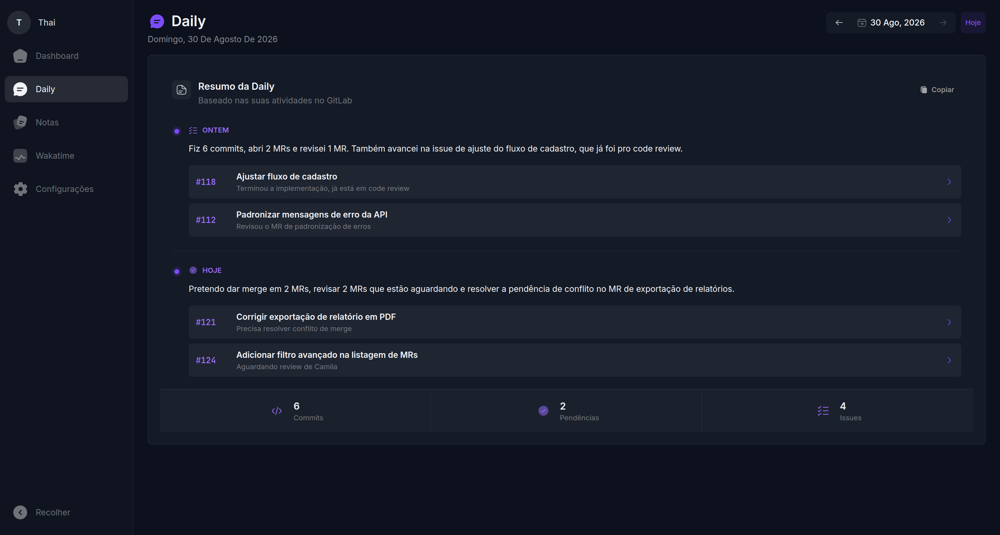
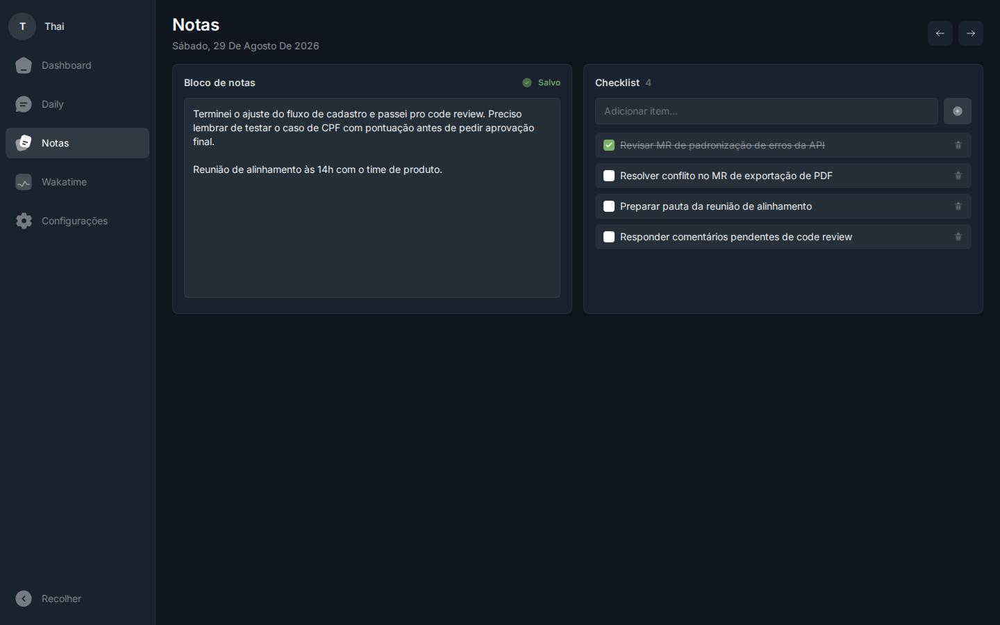
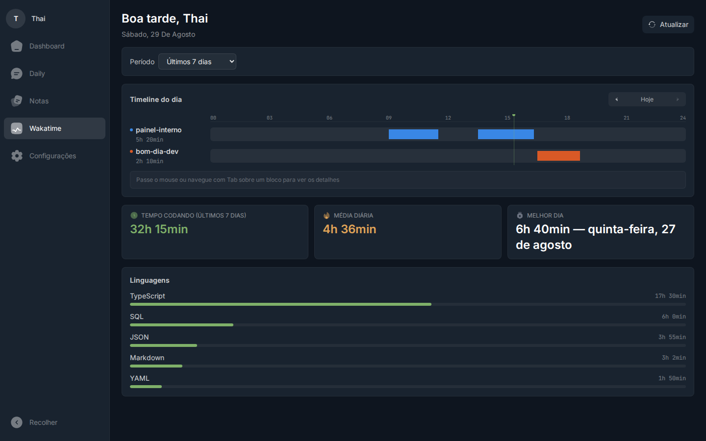
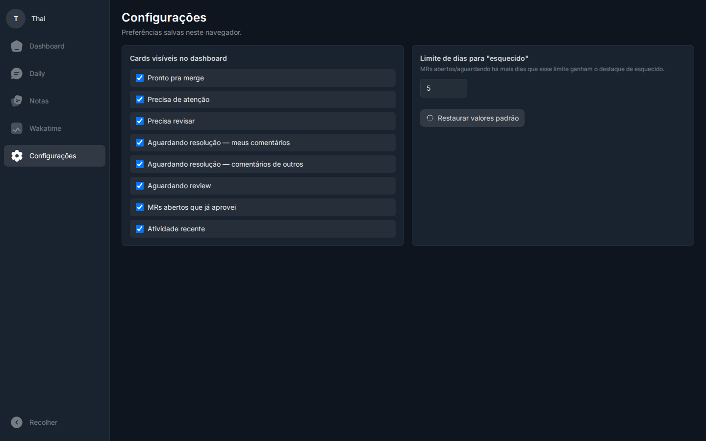

# bom-dia-dev ☀️

Painel diário pessoal para abrir toda manhã antes de começar a trabalhar.
Reúne, em português e dark theme, o estado dos seus MRs no GitLab, uma
narrativa pronta pra daily standup, notas/checklist do dia e suas
estatísticas de tempo codando (Wakatime) — tudo escaneável.



## O que ele mostra

- **Dashboard** — status dos MRs abertos, classificados em:
  - 🔴 **Atenção** — pipeline falhou, há conflito de merge ou tem comentário
    de code review pendente.
  - 🟢 **Pronto** — pipeline passou, tem ao menos uma aprovação e sem
    conflito.
  - 🟡 **Aguardando** — qualquer outro caso.

  Também mostra revisões pendentes atribuídas a você (separadas por
  situação: precisa revisar, aguardando resposta sua/de outros, já
  aprovado), tempo médio até merge e até a primeira aprovação, atividade
  recente estilo `git log --oneline` e seus to-dos do GitLab. O card "Seu
  desempenho" tem período selecionável (7/14/30 dias ou customizado) e
  compara, em dois painéis, MRs abertos x fechados e tempo médio até merge
  entre o período atual e o anterior.
- **Daily** — narrativa "o que fiz ontem / o que pretendo fazer hoje"
  gerada por LLM (via OpenRouter) a partir da atividade real no GitLab, com
  fallback heurístico caso a LLM falhe e histórico por dia. Cada item de
  ontem/hoje linka direto pra issue correspondente no GitLab, com estatísticas
  de commits/pendências/issues do dia.
- **Notas** — bloco de notas com editor de texto rico (negrito, itálico,
  sublinhado, listas, links) + checklist com reordenação por
  drag-and-drop, um registro por dia com autosave, lista de notas recentes
  (com paginação) e resumo do dia (tarefas totais/concluídas, progresso,
  palavras escritas).
- **Wakatime** — tempo codando por período (hoje, semana, mês, customizado),
  timeline de sessões por projeto no dia, linguagens/projetos/categorias
  mais usados, horário e dia da semana mais produtivos, sequência de dias
  consecutivos codando, maior sessão do período, editores e sistemas
  operacionais usados, e percentual de código assistido por IA.
- **Configurações** — mostrar/ocultar cards do dashboard e ajustar o limite
  de dias pra um MR ser marcado como "esquecido" (preferências salvas no
  `localStorage` do navegador, não sincronizam entre dispositivos).

## Telas

<table>
<tr>
<td width="50%">

**Daily**


</td>
<td width="50%">

**Notas**


</td>
</tr>
<tr>
<td width="50%">

**Wakatime**


</td>
<td width="50%">

**Configurações**


</td>
</tr>
</table>

> Os prints acima usam dados fictícios (gerados só pra ilustrar o layout).
> Não são MRs, notas ou estatísticas reais.

## Stack

- **Backend** (`backend/`): Express + TypeScript. Não usa a lib oficial do
  GitLab nem chama a API REST diretamente — chama o binário [`glab`](https://gitlab.com/gitlab-org/cli)
  (GitLab CLI) via `child_process.execFile` e faz `JSON.parse` do stdout.
  Narrativa da Daily via [OpenRouter](https://openrouter.ai) (modelo
  gratuito por padrão). Estatísticas de código via API do
  [Wakatime](https://wakatime.com). Persistência (notas, checklist, daily)
  em [Turso](https://turso.tech) (SQLite hospedado, via `@libsql/client`).
  Testes automatizados com Vitest.
- **Frontend** (`web/`): Vite + React + TypeScript + Tailwind CSS v4
  (tema custom via `@theme`, sem `tailwind.config.js`) + `@solar-icons/react`
  e `react-icons` para ícones + `recharts` para os gráficos de desempenho e
  do Wakatime + `react-router-dom` para as rotas das abas + `@tiptap/react`
  para o editor de texto rico das notas + `@dnd-kit` para o
  drag-and-drop do checklist. Fontes Inter (sans) e JetBrains Mono (mono).
- **Docker**: `docker-compose.yml` na raiz sobe os dois serviços
  (`backend` na porta 3001, `web` na porta 5173, proxy `/api` do Vite pro
  `backend`).

## Pré-requisitos

- Node.js 20+ (ou Docker, se for rodar via `docker compose`).
- Rodando sem Docker: o binário [`glab`](https://gitlab.com/gitlab-org/cli)
  precisa estar instalado e no `PATH` (no modo Docker ele já vem instalado
  na imagem do backend).
- Um **Personal Access Token** do GitLab com escopo somente leitura
  (`read_api`).
- Uma conta gratuita no [Turso](https://turso.tech) com um banco criado —
  **obrigatório**, o backend não sobe sem isso (ver [Banco de dados](#banco-de-dados-turso)
  abaixo).
- Opcional: uma API key do [Wakatime](https://wakatime.com/settings/api-key)
  (pra aba Wakatime funcionar) e/ou do [OpenRouter](https://openrouter.ai/settings/keys)
  (pra narrativa da Daily ser gerada por LLM — sem ela cai num resumo
  heurístico mais simples).

## Como rodar

1. Copie o `.env.example` para `.env` na raiz.
2. Crie um banco no Turso (ver seção abaixo) e preencha `TURSO_DATABASE_URL`
   e `TURSO_AUTH_TOKEN` no `.env`, junto com `GITLAB_TOKEN` e, se quiser,
   `WAKATIME_API_KEY`/`OPENROUTER_API_KEY`.
3. Suba a aplicação:

   ```bash
   # Modo Docker (recomendado)
   docker compose up --build
   # abre http://localhost:5173

   # Ou sem Docker, na raiz do projeto
   npm install
   npm run dev   # roda backend (porta 3001) e web (porta 5173) juntos
   ```

## Banco de dados (Turso)

Notas, checklist e o histórico da Daily ficam persistidos num banco SQLite
hospedado no Turso (plano free é suficiente pro uso pessoal) — não em
arquivo local, pra não perder os dados trocando de máquina e pra não expor
dados pessoais versionando um `.sqlite` no repo.

```bash
# instalar a CLI
curl -sSfL https://get.tur.so/install.sh | bash

turso auth login                     # abre o navegador
turso db create bomdiadev            # cria o banco
turso db show bomdiadev --url        # -> TURSO_DATABASE_URL
turso db tokens create bomdiadev     # -> TURSO_AUTH_TOKEN
```

O schema é criado automaticamente (migrations em `backend/src/db/migrations/`)
na primeira vez que o backend sobe. Se você já tinha dados num
`backend/data/bomdiadev.sqlite` local (versão anterior, pré-Turso), copie-os
pro Turso com:

```bash
npm run migrate-to-turso --prefix backend
```

## Estrutura do projeto

```
backend/src/
  glab.ts                  # wrapper único de chamadas ao binário glab (glabApi<T>)
  gitlab.ts                # funções de alto nível sobre a API do GitLab (MRs, aprovações, eventos, issues, todos...)
  dashboard.ts             # monta o payload final: classificação de MRs, desempenho, atividade recente, narrativa do dia
  narrative.ts             # classificador heurístico de atividade em issues (por palavra-chave)
  standup.ts               # narrativa "ontem/hoje" via LLM (OpenRouter), com fallback heurístico e persistência
  wakatime.ts              # integração com a API do Wakatime (stats + timeline)
  wakatimeCalculations.ts  # cálculos derivados dos dados do Wakatime (streaks, horário/dia mais produtivo, AI coding...)
  db.ts                    # client do Turso/libSQL (lazy, não conecta em import) + runner de migrations
  db/migrations/           # migrations .sql, aplicadas automaticamente no boot
  routes/
    notes.ts               # notas + checklist por dia
    daily.ts               # histórico e detalhe da daily gerada
  index.ts                 # rotas: /api/dashboard, /api/wakatime(/timeline), /api/notes, /api/daily
scripts/
  migrate-to-turso.ts  # script de uso único: copia dados de um SQLite local pro Turso

web/src/
  App.tsx                 # rotas (react-router-dom): /, /daily, /notas, /wakatime, /configuracoes
  SettingsContext.tsx     # preferências do usuário (localStorage, sem backend)
  formatting.ts           # helpers de data/hora/duração compartilhados entre páginas
  components/
    ui/                     # kit compartilhado: Button, Card, Input/Select, IconButton, Alert, Page/PageHeader
    notes/                  # editor de texto rico, checklist (drag-and-drop), navegação de data, notas recentes
    Sidebar.tsx, Header.tsx, PerformanceCard.tsx, WakatimeInsightCards.tsx, WakatimeTimelineCard.tsx, skeletons/...
  pages/
    DashboardPage/, DailyPage/, NotesPage/, WakatimePage/, SettingsPage/   # cada página em pasta própria (Index.tsx + hooks locais, ex. useNoteEditor/useChecklist/useRecentNotes)
```

## Importante: autenticação com o GitLab

O backend usa um **Personal Access Token** via variável de ambiente
`GITLAB_TOKEN` — nunca a sessão OAuth interativa do `glab` (a que fica em
`~/.config/glab-cli/`). Isso é intencional: montar/copiar essa sessão OAuth
em containers ou processos paralelos já quebrou a autenticação do host
anteriormente, porque o refresh token é rotativo e de uso único, validado no
servidor do GitLab. Veja detalhes em [`CLAUDE.md`](./CLAUDE.md).

## Decisões de escopo

- Sem auto-refresh no dashboard — só carga inicial + botão manual.
- Sem autenticação/multiusuário — é um painel pessoal, single-user, local.
- Testes automatizados (Vitest) cobrem a classificação de MRs e a geração
  da narrativa da Daily (`backend/src/*.test.ts`); não há testes de
  frontend.

## Licença

Projeto pessoal, sem licença definida.
